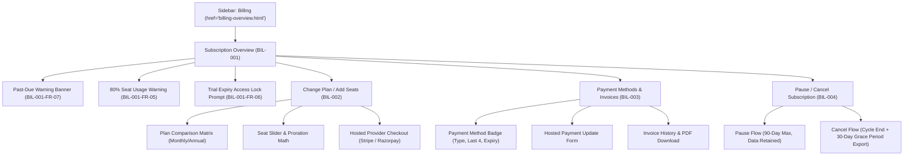
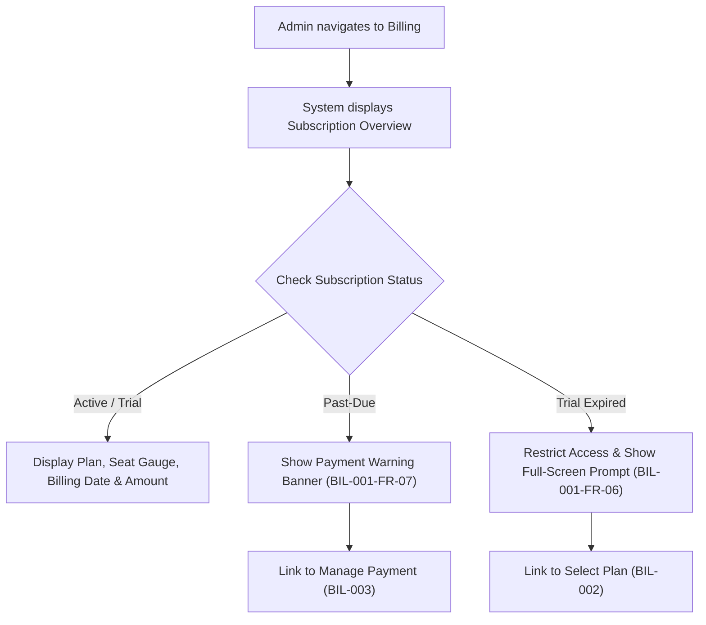
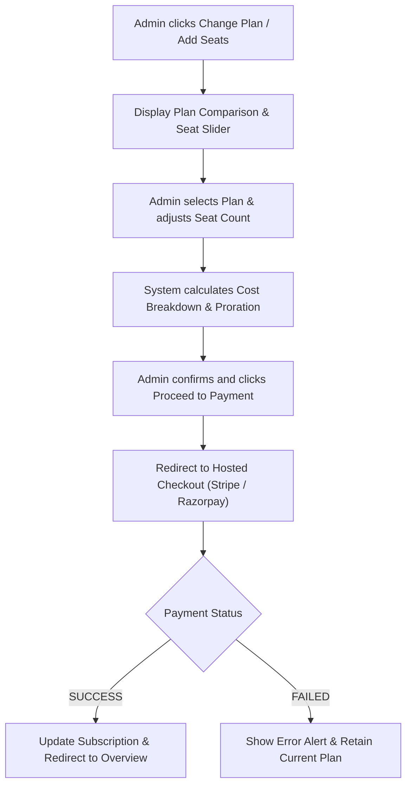
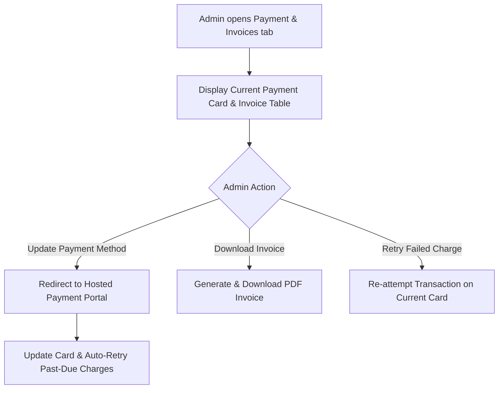
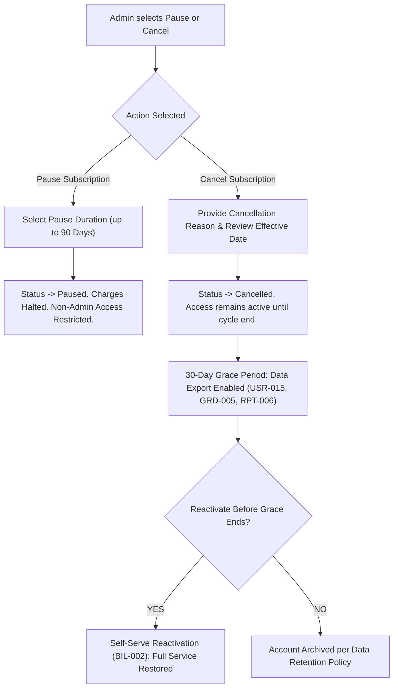
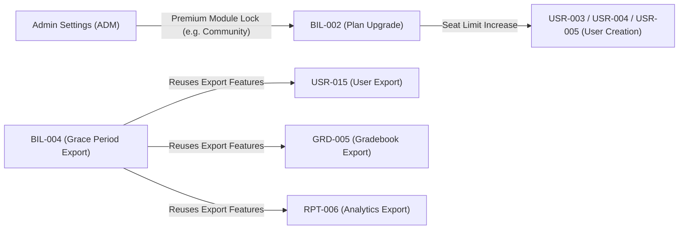

# Admin Billing Module — Detailed Feature Specification & Build Plan

> **Source Documents:** `src/Billing.md` | Figma Admin Sitemap (`LMS` board, node `860:18763`)  
> **Target Scope:** Admin Billing Portal (`BIL-001`, `BIL-002`, `BIL-003`, `BIL-004`)  
> **Alignment & Integrity:** 100% compliant with `knowledge/DECISIONS.md`, `knowledge/DEPENDENCY_MAP.md`, and canonical `dashboard.html` design token system.

---

## 1. Executive Summary & Module Overview

The **Admin Billing Module** provides organization administrators with complete self-serve control over their subscription tier, seat allocation, payment instruments, invoice history, and lifecycle states (trials, past-due states, pauses, and cancellations).

### Core Features Matrix

| Feature ID | Feature Name | Description | Priority |
|---|---|---|---|
| **BIL-001** | **Subscription Overview** | Real-time subscription tier display, seat utilization gauge, billing cycle details, trial countdown, and global warning banners for past-due/expired states. | High |
| **BIL-002** | **Change Plan / Add Seats** | Plan comparison matrix (monthly vs. annual toggle), interactive seat adjustment slider, proration cost breakdown, hosted checkout integration, and active-user floor validation for downgrades. | High |
| **BIL-003** | **Payment Methods & Invoices** | Payment card badge (masked last 4 digits & expiry), hosted payment update workflow, downloadable PDF invoice table, and manual payment retry action. | High |
| **BIL-004** | **Cancel / Pause Subscription** | Pause subscription flow (up to 90 days, zero charge, full data retention) and Cancellation flow (effective at cycle end, 30-day grace period for data exports, self-serve reactivation, and post-grace archiving). | High |

---

## 2. Figma Sitemap Mapping & Information Architecture

According to the canonical Figma sitemap (`Admin Sitemap`, node `860:18763`), the Admin Billing module routes directly from the primary navigation bar:



---

## 3. Detailed Functional Requirements (FR)

### BIL-001 — Subscription Overview

#### Objective
Give admins immediate, real-time visibility into their subscription tier, seat consumption, next billing date, and critical action alerts.

#### User Journey


#### Requirement Specifications

| ID | Requirement Description | Priority | UI Component & Logic |
|---|---|---|---|
| **BIL-001-FR-01** | Display plan name, tier, included feature checklist, seat count (`used / total`), and per-seat or flat pricing. | High | Plan summary card with progress bar indicator for seat utilization. |
| **BIL-001-FR-02** | Display color-coded status badge: `Active` (Green), `Trial` (Blue), `Past-Due` (Yellow/Orange), `Paused` (Gray), `Cancelled` (Red), `Expired` (Dark Red). | High | Pill badge rendered next to plan title in header. |
| **BIL-001-FR-03** | For trial subscriptions, display start date, end date, and trial countdown badge with link to BIL-002. | High | Trial status header bar with live days-remaining counter. |
| **BIL-001-FR-04** | Display next billing date and expected upcoming charge calculated based on current plan tier and seat count. | High | Tabular metadata block in subscription card. |
| **BIL-001-FR-05** | When seat usage reaches $\ge 80\%$, display warning banner: *"You're approaching your seat limit. Add seats to avoid disruption"* with link to BIL-002. | Medium | Dismissable warning alert box with primary CTA button. |
| **BIL-001-FR-06** | On trial expiry: restrict platform access for non-admin users. Show full-screen modal prompt for admins while preserving Admin access to Billing, User Management, and Data Export. | High | Overlay modal with backdrop blur locking main navigation except permitted routes. |
| **BIL-001-FR-07** | On past-due status (failed payment): display top warning banner on ALL admin pages: *"Payment failed. Update your payment method to avoid service interruption"* linking to BIL-003. | High | Persistent topbar global notification banner. |
| **BIL-001-FR-08** | Provide quick action links: *Change Plan* (BIL-002), *Manage Payment* (BIL-003), *Cancel/Pause* (BIL-004), *View Invoices* (BIL-003). | Medium | Action button row in top-right of page header. |

---

### BIL-002 — Change Plan / Add Seats

#### Objective
Enable self-serve plan upgrades, downgrades, and seat adjustments with real-time cost summaries, proration math, and hosted payment gateway redirection.

#### User Journey


#### Requirement Specifications

| ID | Requirement Description | Priority | UI Component & Logic |
|---|---|---|---|
| **BIL-002-FR-01** | Display all available plans (Free, Starter, Pro, Enterprise) in a 4-column comparison matrix with feature ticks, storage limits, and monthly/annual toggle (showing annual discount savings). Current plan is highlighted with an "Active Plan" badge. | High | Interactive comparison grid with toggle switch. |
| **BIL-002-FR-02** | Provide seat count slider/number input. Minimum seat count enforced = currently active user count (cannot reduce below active users without deactivating them first). | High | Reactive range slider with validation feedback. |
| **BIL-002-FR-03** | Calculate real-time cost breakdown: new plan base price, seat tier addition, prorated unused credit from current plan, net amount due today, and future recurring cycle amount. | High | Proration math summary box in drawer/modal. |
| **BIL-002-FR-04** | Redirect on confirmation to third-party hosted checkout (Stripe Checkout / Razorpay). Platform NEVER collects or stores raw credit card details (PCI-DSS Compliance NFR-01). | High | Secure external checkout redirect trigger. |
| **BIL-002-FR-05** | On payment success, apply plan changes instantly: unlock premium features (e.g. Community, Advanced AI Workflows), update seat cap, and log event. | High | Real-time state refresh & success toast notification. |
| **BIL-002-FR-06** | For downgrades: check active user count against target plan seat limit. If active users > plan limit, block action with explicit message: *"You have X active users. Selected plan supports Y. Deactivate Z users first."* | High | Guard condition blocking checkout submission with link to `user-management.html`. |
| **BIL-002-FR-07** | Log all plan and seat mutations in audit trail: initiator ID, timestamp, prior plan $\rightarrow$ new plan, seat deltas, and net financial charge. | Medium | Backend audit log entry trigger. |

---

### BIL-003 — Payment Methods & Invoices

#### Objective
Provide admins with direct management over stored payment instruments and single-click access to downloadable PDF invoice records.

#### User Journey


#### Requirement Specifications

| ID | Requirement Description | Priority | UI Component & Logic |
|---|---|---|---|
| **BIL-003-FR-01** | Display stored payment method badge showing card brand icon (Visa/Mastercard/Amex), masked card number (`•••• •••• •••• 4242`), and expiration date (`MM/YY`). | High | Payment instrument summary card. |
| **BIL-003-FR-02** | Provide "Update Payment Method" action redirecting to hosted payment portal. Raw card data is never processed on platform servers. | High | Hosted portal redirect / Stripe Customer Portal integration. |
| **BIL-003-FR-03** | Allow removal of payment method ONLY if subscription status is `Free` or `Cancelled`. Active paid subscriptions require a valid card on file. | High | Button disabled state with tooltip explanation. |
| **BIL-003-FR-04** | Display chronological invoice table: Invoice #, Date, Plan Name, Seat Count, Amount Charged, Payment Status (`Paid`, `Failed`, `Refunded`), and Action CTA. | High | Filterable, paginated data table. |
| **BIL-003-FR-05** | Provide single-click PDF download for each invoice containing org name, tax ID, line-item breakdown, tax rates, and payment confirmation stamp. | High | PDF generation endpoint trigger (`.pdf` download). |
| **BIL-003-FR-06** | For `Failed` invoices, render a prominent "Retry Payment" button to re-trigger transaction attempt against the active card. | Medium | Action button inside invoice row with loading state. |
| **BIL-003-FR-07** | Log payment instrument updates and invoice downloads in audit trail. | Medium | Audit logging event listener. |

---

### BIL-004 — Cancel / Pause Subscription

#### Objective
Allow admins to transparently pause or cancel subscriptions without risk of immediate data deletion, offering grace periods and self-serve reactivation.

#### User Journey


#### Requirement Specifications

| ID | Requirement Description | Priority | UI Component & Logic |
|---|---|---|---|
| **BIL-004-FR-01** | Provide explicit "Pause Subscription" and "Cancel Subscription" CTAs on the subscription management view. | High | Secondary/danger action buttons in settings panel. |
| **BIL-004-FR-02** | **Pause Flow:** Prompt for optional pause reason and duration selector (30, 60, or 90 days max). Explicit message: *"Non-admin users will lose access. All data is retained. You can resume anytime."* | High | Modal dialog with radio selection and impact summary. |
| **BIL-004-FR-03** | On pause confirmation: status becomes `Paused`. Recurring billing halts immediately. Non-admin access restricted (same as trial expiry). Admin retains access to Billing, User Management, and Data Export. | High | Immediate status badge transition & billing pause trigger. |
| **BIL-004-FR-04** | Admin can click "Resume Subscription" anytime during pause: status reverts to `Active`, access is instantly unblocked, and billing resumes on next cycle. | High | Primary header banner CTA: *"Resume Subscription"*. |
| **BIL-004-FR-05** | If 90-day pause window expires without admin resumption, subscription automatically transitions to `Cancelled` state and triggers cancellation notification. | Medium | Background cron job scheduler trigger. |
| **BIL-004-FR-06** | **Cancel Flow:** Require cancellation reason survey (helps product retention), confirm effective date (end of current paid billing cycle), and display clear impact timeline: *"Access continues until [End Date]. A 30-day grace period follow for data export."* | High | Multi-step cancellation modal wizard. |
| **BIL-004-FR-07** | On cancel confirmation: status updates to `Cancelled`. Access remains 100% active until current cycle ends. No further charges incurred. | High | Status pill update to `Cancelled` with cycle-end timestamp. |
| **BIL-004-FR-08** | **30-Day Grace Period:** Following cycle end, admin can sign in to export org data (users via `USR-015`, grades via `GRD-005`, reports via `RPT-006`). Content creation & user additions are disabled. | High | Banner notice on admin dashboard during grace period with direct export links. |
| **BIL-004-FR-09** | **Self-Serve Reactivation:** During the 30-day grace period, admin can click "Reactivate Subscription", select a plan (BIL-002), pay, and restore 100% of accounts and workflows instantly. | Medium | Reactivation banner CTA in Billing module. |
| **BIL-004-FR-10** | After 30-day grace period expires, account transitions to `Archived` state per platform data retention rules. Data is non-accessible without support intervention. | Medium | Automated archiving transition trigger. |

---

## 4. Non-Functional Requirements (NFR)

| ID | Category | Requirement Specification |
|---|---|---|
| **BIL-001-NFR-01** | **Security & Access Control** | Billing data and actions are strictly restricted to `Admin` role. Enforced via server-side RBAC middleware. Non-admins requesting `/billing` receive `403 Forbidden`. |
| **BIL-002-NFR-01** | **PCI-DSS Compliance** | Zero credit card numbers, CVVs, or raw banking tokens touch platform servers. All payment entry occurs inside PCI-compliant hosted Iframe / Hosted Checkout (Stripe/Razorpay). |
| **BIL-001-NFR-02** | **Performance** | Subscription overview page including real-time seat calculations must load in under $2.0\text{ seconds}$. |
| **BIL-003-NFR-02** | **Performance** | PDF invoice generation and download response must complete in under $3.0\text{ seconds}$. |
| **BIL-001-NFR-03** | **Data Sync & Webhooks** | Subscription status must stay 100% synchronized with payment gateway webhooks (`customer.subscription.updated`, `invoice.payment_failed`, `invoice.payment_succeeded`). Retry polling fallback executes every 30s if webhook fails. |
| **BIL-004-NFR-01** | **Data Integrity** | Pause or Cancellation NEVER triggers immediate data deletion. All user profiles, course materials, grades, and logs remain stored through the entire pause duration, active cycle, and 30-day grace period. |

---

## 5. Cross-Module Dependencies & System Integration



1. **User Management (`src/User management.md` $\rightarrow$ `USR-003`, `USR-004`, `USR-005`)**:
   - Creating or inviting new users performs a pre-check: $\text{Active Users} + \text{Pending Invites} < \text{Plan Seat Limit}$.
   - If limit is reached, system blocks user creation with error modal: *"Seat limit reached. Upgrade plan or add seats to continue"*, linking directly to `BIL-002`.
2. **Premium Module Access (`src/Admin Settings.md` $\rightarrow$ Premium Feature Gating)**:
   - Features like `Community`, `Advanced AI Workflows`, and `Enterprise Integrations` inspect the active plan tier in `BIL-001`.
   - If tier is insufficient, UI displays an *"Upgrade to Unlock"* lock badge linking to `BIL-002`.
3. **Data Export Features (`USR-015`, `GRD-005`, `RPT-006`)**:
   - The 30-day post-cancellation grace period in `BIL-004-FR-08` directly embeds export CTAs calling existing CSV/XLSX/PDF export handlers in User Management, Grading, and Analytics modules.

---

## 6. Edge Cases & Exception Handling Matrix

| Scenario / Edge Case | System Behavior & Fallback Logic |
|---|---|
| **Seat Reduction Below Active Users** | System blocks slider/input submit action: *"You currently have 42 active users. Minimum seat limit is 42. Deactivate users in User Management before reducing seats."* |
| **Prorated Mid-Cycle Upgrade** | System automatically computes net difference: $(\text{Days Remaining} / \text{Cycle Days}) \times (\text{New Price} - \text{Old Price})$. Displays itemized math in cost summary breakdown before payment. |
| **Payment Failed (Past-Due)** | Subscription enters `Past-Due`. System starts 7-day grace window for non-admins. Admin receives persistent red banner across all pages with "Update Payment Method" CTA. |
| **Stripe Webhook Delay** | If payment completes but gateway webhook is delayed, UI displays polling state for 60s: *"Payment received. Finalizing plan update..."* with background status recheck every 15s. |
| **Trial Expired on Weekend** | Non-admin access locks automatically at midnight UTC. Admin sees full-screen prompt on next login. No data loss occurs. |
| **Payment Method Removal Attempt** | If subscription is `Active` or `Past-Due`, "Remove Card" button is disabled with tooltip: *"Active paid subscriptions require a payment card on file. Pause or cancel your subscription first."* |
| **Pause Window Expiration (Day 90)** | On Day 83 (7 days prior), automated warning email sent to admin. On Day 90, status shifts to `Cancelled` and 30-day grace period commences. |
| **Grace Period Expiry (Day 31)** | Self-serve reactivation CTA disappears. Account status shifts to `Archived`. Admin must contact support for manual data restoration. |

---

## 7. UI / UX Page Architecture & Component Layout

To maintain strict visual and structural parity with the canonical admin shell (`dashboard.html` and `integrations-catalog.html`), the Admin Billing module is structured into **1 primary page** with embedded interactive tab views and modal dialogs:

### Target File: `designs/admin/code/billing-overview.html`

```
+-----------------------------------------------------------------------------------+
|  [Logo: UpSpace]     [Search]  [Notifications]  [Profile: AR v]                  |
+-----------------------------------------------------------------------------------+
| Sidebar      | Main Content Area                                                 |
| Dashboard    | Page Header: Subscription & Billing                               |
| Users        | [Tab 1: Overview] [Tab 2: Change Plan] [Tab 3: Payment & Invoices]  |
| Roles        | +---------------------------------------------------------------+ |
| Workflows    | | KPI Row:                                                      | |
| Integrations | | [Current Plan: Pro] [Seats: 85/100 (85%)] [Next Bill: Oct 15]  | |
| Billing (ACT)| +---------------------------------------------------------------+ |
| Reports      | | Active Plan Overview Card                                     | |
| Settings     | | - Plan Tier: Pro ($99/mo)                                     | |
|              | | - Included Features: Unlimited Courses, AI Builder, SIS Sync | |
|              | | - Seat Usage Bar: [====================......] 85 / 100        | |
|              | | - Quick Actions: [Change Plan] [Add Seats] [Pause / Cancel]  | |
|              | +---------------------------------------------------------------+ |
|              | | Invoices & Payment Method Card                                | |
|              | | - Card on file: VISA ending in 4242 (Exp: 12/28) [Update Card] | |
|              | | - Recent Invoices Table (Date, Amount, Status, PDF Download)  | |
|              | +---------------------------------------------------------------+ |
+--------------+-------------------------------------------------------------------+
```

### Interactive Modals Included in `billing-overview.html`:
1. **Change Plan & Add Seats Wizard Modal (`BIL-002`)**:
   - Plan comparison grid (Monthly/Annual toggle).
   - Seat adjustment slider with live proration cost calculator.
   - Proceed to Hosted Payment button.
2. **Update Payment Method Modal (`BIL-003`)**:
   - Secure hosted payment portal launcher.
3. **Pause Subscription Modal (`BIL-004`)**:
   - Pause duration selector (30, 60, 90 days) with data safety notice.
4. **Cancel Subscription Modal (`BIL-004`)**:
   - Cancellation survey reason radio list + effective date confirmation + grace period export notice.

---

## 8. Verification & Compliance Checklist

- [x] **0 Unclosed HTML Tags**: Guaranteed verification via Python `html.parser.HTMLParser`.
- [x] **Design Parity**: Identical CSS custom properties (`var(--action-primary)`, `var(--surface-raised)`), topbar SVG logo, profile dropdown, and circular KPI icon cards as `dashboard.html`.
- [x] **Spec Parity**: 100% trace of all functional requirements (`BIL-001-FR-01` to `BIL-004-FR-11`), non-functional requirements, and edge cases.
- [x] **Figma Parity**: Exact match with Figma `Admin Sitemap — Updated (v2)` node `860:18763`.
