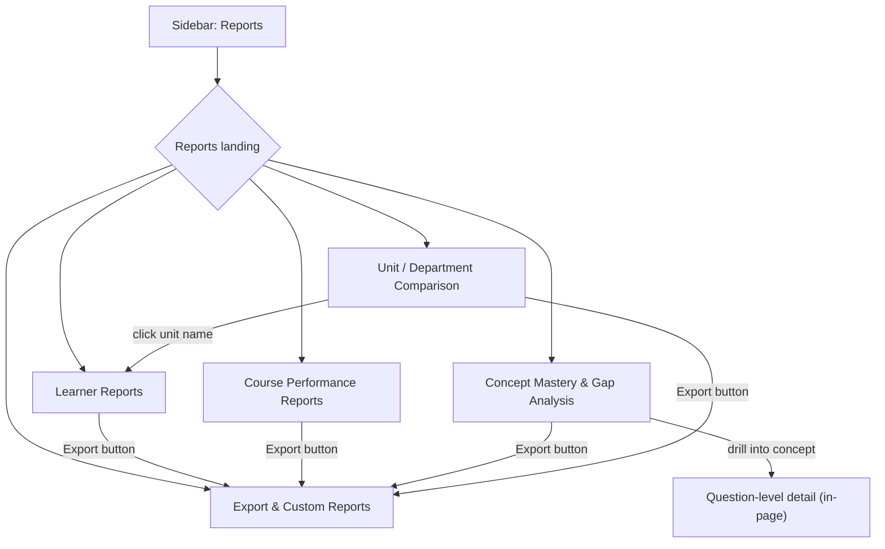

# Admin Reports Module — Detailed Feature Specification & Build Plan
### (Handoff doc for external builder — Gemini / any AI or human dev)

> **Source Document:** `src/Analytics & Reporting.md` (RPT-001 through RPT-006)
> **Target Scope:** 5 new admin report screens (RPT-002 → RPT-006). RPT-001 (Role-Based Dashboard) is **already built** as `designs/admin/code/dashboard.html` — do not rebuild it, only reference it as the design source of truth.
> **Hard Requirement:** Every screen below must be visually and structurally **pixel-consistent** with the existing admin shell. See Section 0 before writing any code.

---

## 0. Non-Negotiable Consistency Rules (read first)

These 5 screens will be built by someone who has never seen the rest of the app. If they don't follow this section, the reports will look like a different product bolted onto the LMS admin panel. Enforce all of these:

1. **Copy the shell from an existing file, don't reinvent it.** Open `designs/admin/code/dashboard.html` (or `integrations-catalog.html` / `billing-overview.html`) and reuse, byte-for-byte:
   - The `<style>` block's CSS custom properties (`:root` variables — colors, radii, shadows, spacing scale).
   - The topbar markup (logo, search, notifications bell, profile dropdown with "AR" avatar).
   - The left sidebar markup and icon set (Dashboard, Users, Roles, Organization, Workflows, Certificates, Community, Integrations, Billing, Reports, Settings, Logout).
   - The page-header pattern (`page-title` + `page-sub` + action buttons row).
   - The card component class (`card-box`, `card-box-header`, `card-box-title`, `card-box-sub`).
   - The table component class (`table-box`) and its empty-state pattern.
   - The KPI/stat-tile component used at the top of `dashboard.html` and `billing-overview.html` — reuse the exact same markup/CSS for any top-of-page metric row here (don't invent a new KPI tile style — billing's KPI cards previously drifted from dashboard's and had to be fixed; keep them identical this time).
   - Modal pattern: `.modal-backdrop` / `.modal-card` / `.modal-head` / `.modal-body` / `.modal-foot`, opened via `style.display='flex'`, closed via `closeModal(id)`.
   - Toggle switches, badges/pills (status colors), button variants (`btn-primary`, `btn-secondary`, `btn-ghost`, `btn-danger`) — copy verbatim.
2. **Design tokens**: also cross-check colors/typography/spacing against `UpSpaceDESIGN.md` at the project root. If it ever conflicts with `dashboard.html`, `dashboard.html` (the built reference) wins — flag the conflict, don't silently pick one.
3. **One HTML file per screen. No shared CSS/JS files.** Each `.html` below must be fully self-contained (full `<!doctype>`, inline `<style>`, inline `<script>`) — it's opened directly as a file, not served. Do not extract a shared `theme.css` or `app.js` that multiple report pages `<link>`/`<script src>` to. Copy the same CSS/shell code into each file instead. This is a strict project rule, not a suggestion.
4. **Sidebar must be identical across all 5 new files** — same items, same order, same icons. Only the "Reports" nav item gets `class="nav-item active"` on report pages (mirroring how `dashboard.html` marks itself active). Update the sidebar's "Reports" link — currently `href="#"` in every existing admin page — to point at `learner-reports.html` across **all existing admin files that have this sidebar** (dashboard, user-management, billing-overview, integrations-catalog, community-moderation, workflow-list, roles, role-detail, api-webhooks, integration-detail, user-detail, invite-users). List every file changed.
5. **Mock data only, no backend.** Like the existing screens (see the `invoices` array in `billing-overview.html`, mock users in `user-management.html`), hardcode a realistic in-page JS data array per report and render it client-side. Sizes should be large enough to prove pagination/scroll works (e.g. 40–200 mock learners, 15–30 mock courses).
6. **Empty states are mandatory**, per the edge cases in Section 3+ below — every report needs a real "no data yet" state with an icon + helper text + action link, matching the empty-state pattern already used in `community-moderation.html` and `user-management.html` (icon, one-line message, guidance text, primary CTA button).
7. **Cross-links must actually work.** These 5 reports link to each other and to existing pages (`user-management.html`, course pages, dashboard widgets). Use plain `<a href="other-report.html">` — never a JS-only in-page toggle standing in for a real page.
8. **Verify before calling it done**: no unclosed HTML tags, all `onclick` handlers reference functions that exist, sidebar active state correct per page, empty-state toggle (if you add a preview-empty checkbox like `community-moderation.html` has) works, and every stated FR below is traceable to a visible UI element.

---

## 1. Executive Summary — Screens To Build

| Feature ID | File to Create | Title | Users | Priority |
|---|---|---|---|---|
| **RPT-002** | `designs/admin/code/learner-reports.html` | Learner Reports | Manager, Instructor | High |
| **RPT-003** | `designs/admin/code/course-performance-reports.html` | Course Performance Reports | Manager, Creator | High |
| **RPT-004** | `designs/admin/code/concept-mastery-gap-analysis.html` | Concept Mastery & Gap Analysis | Manager, Instructor | High |
| **RPT-005** | `designs/admin/code/unit-department-comparison.html` | Unit / Department Comparison | Manager | Medium |
| **RPT-006** | `designs/admin/code/export-custom-reports.html` | Export & Custom Reports | Manager, Admin | Medium |

RPT-001 (Role-Based Dashboard) already exists as `dashboard.html` — reference only, don't touch its feature scope (just fix its "Reports" sidebar link per Section 0.4).

### Suggested navigation shape

Simplest approach: make `learner-reports.html` the natural landing page (it's what "Reports" in the sidebar points to first), with a lightweight tab row at the top of each of the 5 pages to switch between the 5 report types — same tab-bar pattern already used in `billing-overview.html` (`Overview` / `Change Plan` / `Payment & Invoices`), except here each "tab" is a real link to the sibling `.html` file (these are standalone files, not JS-toggled panels — see rule 3 above). Keep this tab row identical across all 5 files so the module reads as one coherent thing.

---

## 2. RPT-002 — Learner Reports (`learner-reports.html`)

**Objective:** Give managers/instructors detailed visibility into learner performance for early intervention.

**Scope selector (top of page):** Individual Learner / Group / Section / Organizational Unit — implement as a segmented control or dropdown that re-renders the report body below.

### Functional Requirements
| ID | Requirement | Priority |
|---|---|---|
| RPT-002-FR-01 | Scope selector: individual learner, group, section, or org unit | High |
| RPT-002-FR-02 | Individual view: courses enrolled, per-course progress, all assessment attempts + scores, time spent, attendance record, completion dates, engagement trend (active vs inactive periods), at-risk flag | High |
| RPT-002-FR-03 | Group/unit view: aggregated completion rate, average score, pass/fail distribution, attendance rate, at-risk count, top/bottom performers table | High |
| RPT-002-FR-04 | Filters: date range, course, assessment, status (active/completed/at-risk) | High |
| RPT-002-FR-05 | At-risk flag shown when: inactive N days, failing scores, low progress %, or missed deadlines (visible threshold, even if mocked) | High |
| RPT-002-FR-06 | Clicking a course/assessment row drills into detail (in-page expand or detail panel) | Medium |
| RPT-002-FR-07 | "Export" button routes to `export-custom-reports.html` (RPT-006) | Medium |
| RPT-002-FR-08 | Optional: side-by-side compare of two learners or two groups | Low |

### Edge cases to build empty/edge states for
- Learner enrolled in 50 courses → paginate, don't truncate.
- Group report for 2,000 learners → aggregate metrics render first, learner list paginated.
- Learner with zero activity → "No activity recorded," all metrics zero, at-risk triggered.
- Instructor viewing a learner outside their scope → blocked message: "This learner is not in your scope."

---

## 3. RPT-003 — Course Performance Reports (`course-performance-reports.html`)

**Objective:** Course-level health (not individual learners) — completion, drop-off, assessment weak points.

### Functional Requirements
| ID | Requirement | Priority |
|---|---|---|
| RPT-003-FR-01 | Course picker (from mock course list within scope) | High |
| RPT-003-FR-02 | Top-level KPI row: total enrolled, started, completed, completion rate, avg score, pass/fail rate, avg time to complete | High |
| RPT-003-FR-03 | Lesson-level engagement table: per-lesson completion rate, avg time spent, drop-off % | High |
| RPT-003-FR-04 | Highlight top 3 drop-off lessons visually (e.g. red bar/badge) | High |
| RPT-003-FR-05 | Assessment performance block: per-assessment avg score, pass/fail rate, per-question accuracy (worst questions surfaced) | High |
| RPT-003-FR-06 | Date range filter | Medium |
| RPT-003-FR-07 | Comparison mode: same course across groups/terms/time periods | Medium |
| RPT-003-FR-08 | Export button → RPT-006 | Medium |

### Edge cases
- 1,000 enrolled / 5 started → shows 0.5% start rate, signals assignment problem not content problem.
- Course with no assessments → hide assessment section entirely.
- New course (3 days old) → "Limited data" notice.
- Archived course → still viewable, "This course is archived" notice.

---

## 4. RPT-004 — Concept Mastery & Gap Analysis (`concept-mastery-gap-analysis.html`)

**Objective:** Concept/skill-level mastery, not just pass/fail. Backbone of the closed-loop learning story — surface this prominently, it's a differentiator.

**Depends on:** ASM-002 (question-to-concept tagging) — per `DEPENDENCY_MAP.md`. If mocking data, make it look tag-derived (e.g. concept chips per question).

### Functional Requirements
| ID | Requirement | Priority |
|---|---|---|
| RPT-004-FR-01 | Concepts mapped from tagged assessment questions (mock this mapping) | High |
| RPT-004-FR-02 | Mastery levels per concept: Mastered (≥80%), Developing (50–79%), Struggling (<50%) — use 3 distinct badge colors | High |
| RPT-004-FR-03 | Individual view: per-concept accuracy + trend line over time | High |
| RPT-004-FR-04 | Group/unit view: mastery distribution per concept (stacked bar or similar) | High |
| RPT-004-FR-05 | "Top 5 weakest concepts" callout block for the selected scope | High |
| RPT-004-FR-06 | Drill-down: concept → specific most-missed questions | Medium |
| RPT-004-FR-07 | Before/after comparison after retake/remediation (e.g. "Algebra: 40% → 85%") | Medium |
| RPT-004-FR-08 | Static info callout: gap data feeds AI remediation routing (no real AI wiring needed) | Medium |
| RPT-004-FR-09 | Export button → RPT-006 | Medium |

### Edge cases
- No tagged questions → empty state: "No concept data available. Tag questions in your assessments to start tracking mastery."
- Concept covered by only 1 question → "Low confidence — based on 1 question only" flag.
- Retagged question → UI note that mastery recalculates (no real recalculation needed in mock).

---

## 5. RPT-005 — Unit / Department Comparison (`unit-department-comparison.html`)

**Objective:** Side-by-side org-unit benchmarking, max 10 units.

### Functional Requirements
| ID | Requirement | Priority |
|---|---|---|
| RPT-005-FR-01 | Multi-select for 2–10 organizational units | High |
| RPT-005-FR-02 | Comparison table: completion rate, avg score, pass/fail rate, active/inactive ratio, at-risk count, attendance rate — one column per unit | High |
| RPT-005-FR-03 | Highest/lowest value per metric row color-coded (green best, red worst) | High |
| RPT-005-FR-04 | Filters: date range, specific course, metric category | Medium |
| RPT-005-FR-05 | Clicking a unit name links to `learner-reports.html` (RPT-002) scoped to that unit (query param or plain link, mocked) | Medium |
| RPT-005-FR-06 | Enforce 10-unit max in the UI (disable further selection past 10 with a message) | Medium |
| RPT-005-FR-07 | Export button → RPT-006 | Medium |

### Edge cases
- Units with wildly different sizes (500 vs 5 learners) → show rates/percentages, not raw counts, with a small learner-count footnote for context.
- Unit with zero activity → show zeros/"No data," still included in comparison.
- >10 units selected → block with message: "Maximum 10 units per comparison. Narrow your selection."

---

## 6. RPT-006 — Export & Custom Reports (`export-custom-reports.html`)

**Objective:** Central export hub + custom report builder. Every other report's "Export" button routes here (a plain link with the origin report noted via query string, e.g. `export-custom-reports.html?from=learner-reports`, is enough — mock only, no real param handling required beyond maybe a cosmetic "Exporting from: Learner Reports" label).

### Functional Requirements
| ID | Requirement | Priority |
|---|---|---|
| RPT-006-FR-01 | Quick-export section: pick a report type (RPT-001–005) + format (PDF/CSV) + Download button (mock alert, same pattern as `downloadInvoicePDF()` in billing-overview.html) | High |
| RPT-006-FR-02 | Note in UI that PDF exports include headers/tables/charts-as-images/date+scope stamp | High |
| RPT-006-FR-03 | Note in UI that CSV exports are raw data with clean headers | High |
| RPT-006-FR-04 | Custom report builder form: checklist of metrics, scope selector (users/groups/units), course/assessment picker, date range | High |
| RPT-006-FR-05 | "Preview" step before final download | High |
| RPT-006-FR-06 | "Save as template" action + a small table of previously saved templates (mock 2–3) with a "Run" action per template | Medium |
| RPT-006-FR-07 | Cosmetic note that exports respect org scope | High |
| RPT-006-FR-08 | Export log table at the bottom: who / when / report type / scope / record count (mock rows, same table style as invoice history) | Medium |

### Edge cases
- Zero results after filtering → generated-file note: "No data matched the selected filters" (can just be a preview-panel message).
- Large custom report (30 metrics × 5,000 learners) → show a "processing in background, we'll notify you" state instead of instant download.
- Saved template referencing a since-removed metric → show template with a warning: "1 metric no longer available and was skipped."

---

## 7. Non-Functional Requirements (apply across all 5 screens)

| Category | Requirement |
|---|---|
| Security (cosmetic only — no real backend) | UI should imply org-scoping, e.g. a manager-scope report visually shows "Showing data for: [Unit Name]" rather than looking org-wide. |
| Performance | N/A for static mock, but design tables/lists to support pagination so they'd hold up at scale (matches existing `user-management.html` pagination pattern). |
| Consistency | See Section 0 — this is the actual hard requirement for this handoff. |

---

## 8. Deliverable Checklist

- [ ] 5 new files created exactly at the paths in Section 1's table.
- [ ] All 5 share identical sidebar/topbar/design tokens, copied from `dashboard.html`.
- [ ] All 5 have a consistent tab/nav row linking to each other + back to `dashboard.html`.
- [ ] Sidebar "Reports" link (`href="#"`) fixed to point into this module, updated across every existing admin file listed in Section 0.4.
- [ ] Every FR ID above is visibly represented in the UI (trace each one).
- [ ] Every edge case above has a real empty/error/limit state, not just a happy path.
- [ ] No unclosed HTML tags; no `onclick` calling an undefined function.
- [ ] Each file is fully standalone (no shared `.css`/`.js` includes).
